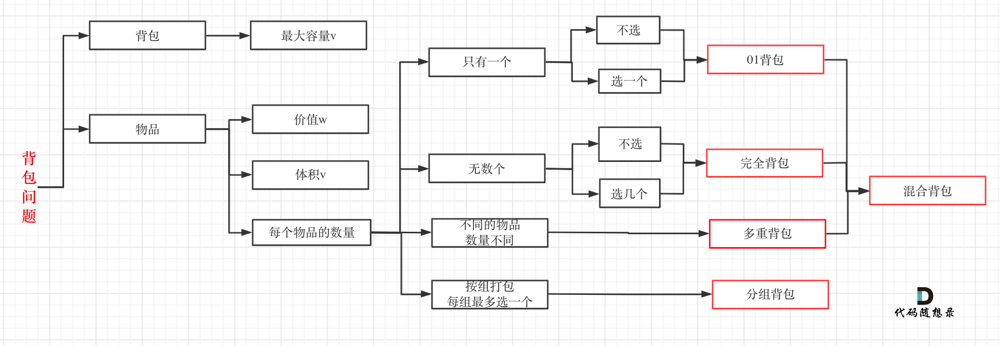

# 时间复杂度
当迭代的次数与输入大小成线性时，O(N)，而迭代次数固定或只有一次则是O(1)

# 二维数组转一维
m * n 二维数组arr[][]

int m = arr.length, n = arr[0].length

[x][y]元素对应的一维数组索引是nx+y

一维索引是i，则对应的x是i/n，y是i%n

# 滑动窗口
滑动窗口口诀</img>

特殊的双指针，常用于数组连续子串问题 209 1456

滑动窗口的头是i，尾是j，新窗口：不滑动的时候是加arr[j]，滑动后是减arr[i]加arr[j]。

若窗口定长k，则先算出第一个窗口的值，滑动后要加arr[j]然后减去arr[j-k]

# 二分查找
正常情况下，前提是有序，直接使用二分查找就行

时间复杂度：O(logN)

取中值用int mid，推荐用以下方式，可以防止溢出
- l + (r - l) / 2 若是偶数个元素，则是中间偏左
- l + (r - l + 1) / 2 若是偶数个元素，则是中间偏右

jdk提供了方法：Arrays.binarySearch(T[] arr, T)

峰值问题，可以不用有序

平方问题，注意二分比较时可能出现超过int型的情况，比较时要转long
```
private static int search(int[] nums, int target) {
    int l = 0, r = nums.length - 1;
    while (r >= l) {
        int mid = l + (r - l) / 2;
        if (nums[mid] == target) return mid;
        if (nums[mid] < target) l = mid + 1;
        else r = mid - 1;
    }
    return -1;
    }
```
# 双指针
1. 普通双指针：同向移动 O(N^2)
2. 碰撞双指针：对向移动 O(N) 前提输入数据必须是有序
   有序数组两数之和
3. 快慢双指针：一个移动快，一个移动慢
- 判断环形链表
  快指针一次跑两下，慢指针跑一下，若是环形的则最终快慢相遇，若非环形则快的会是null或下个是null
- 找环形链表的起始位置
  快指针一次跑两下，慢指针跑一下，然后将慢指针置head，快慢同时一次跑一下，若相遇则此时的位置是环起始位置
- 找链表中间位置
  快指针一次两下，慢指针一次一下，快指针到中点时，慢指针在中点（若是奇数长度则正好是中间，偶数长度则是中间偏右）
- 找链表倒数第k个元素
  快指针先走k步，然后快慢指针同向一次一下，当快指针指向空时，此时慢指针即指向倒数第k个元素

# 二叉树
## 种类
* 普通二叉树：每个节点最多两个孩子
* 满二叉树：除了叶子节点，每个节点都有两个孩子，所有叶子节点都在同一层
* 完全二叉树：从根节点开始从上到下，从左到右填满节点，只有最后一层不是满节点的
* 平衡二叉树：左右子树高度差不大于1
* 二叉搜索树：左子树所有节点都不大于根节点，根节点不大于右子树所有节点
## 存储结构
数组存储时，i的左孩子是i*2+1，右孩子是i*2+2，父节点是(i-1)/2
## 属性 
* 高度： 
  * 节点：从结点x向下到某个叶结点最长简单路径中边的条数（初始值是1，每多一条边就加1）
  * 树：根节点的调度
* 深度：
  * 节点：从根节点往下到节点x（初始值是1）
  * 树：最深的叶结点的深度
* 节点数
  * 满二叉树是2^深度-1
## 遍历
前序遍历（中左右） 后序遍历（左右中） 中序遍历（左中右）
### DFS深度优先搜索
基于栈实现
* 递归
* 迭代（用栈模拟递归，递归运行时实际是隐藏的栈）
### BFS广度优先搜索
基于队列实现
* 层序遍历

# 递归
函数不断地直接或间接自我调用，自顶向下。可与回溯法、深度优先DFS、分治法结合

## 抽象过程
* 确定递归函数的参数和返回值
* 确定终止条件
* 确定单层递归的逻辑

## 复杂度 
时间复杂度：主要看如何拆解, 若是斐波那契则是O(2^N)空间复杂度：O(N)
```
int fib(int n) {
if (n < 2) return n == 1 ? 1 : 0;
return fib(n - 1) + fib(n - 2);
}
```

# 回溯法
一种特殊的递归, 是一个决策树的遍历过程，递归之前做出选择，递归之后撤销选择

本质仍是暴力法，但能解决很多无法预先规定好具体有多少个for循环来处理的问题

可以抽象成一个N叉树
- 宽度，集合的大小，for循环来处理
- 深度，递归的深度，递归来处理。组合问题需要递归startIndex+1，排列问题不需要startIndex因为每次都是从第1个元素开始

有时经常会用到树层去重、树枝不去重，需要定义boolean[] used数组，若为true说明此元素在同一树枝使用过，false说明在同一树层使用过

常用于处理“所有可能”、“所有可能且有效”的问题
- 组合问题，如从1,2,3,4找两个，所有的组合方式
- 排列问题，较组合问题强调元素顺序
- 切割问题，如对字符串有几种切割方式，或切割时加限定如回文
- 子集问题，如1,2,3,4的子集有多少种，一般不需要写终止条件，除非要求是非递减子序列需要至少2个元素等情况
- 棋盘问题，如N皇后、数独

22 78 77 46 八皇后 数独

三要素：
- 路径：也就是已经做出的选择。
- 选择列表：也就是你当前可以做的选择。
- 终止条件：也就是到达决策树底层，⽆法再做选择的条件。在此时收集结果

## 抽象过程
- 确定递归函数参数和返回值
- 确定终止条件，注意收集结果时必须拷贝结果对象，否则后续的变动会影响之前已收集的结果，
  - 若结果是String str，则用str.toString()
  - 若结果是List<> list，则用new ArrayList<>(list)
- 确定单层递归逻辑：做出选择，递归后撤销选择
  - 也可以直接在回溯函数的入参中做出选择而不改变原值，这样会隐藏的撤销选择
  - 当输入包含重复元素且输出要求去重时，先对输入排序，然后做出选择前进行树层去重，而树枝可以重复。因为排序后同一树层若之前已经选择了相同的元素，那其必然已经包含了后续的情况

## 去重
### 非递减子序列2输入有重复，输出结果无重复，且因为是子序列不可重新排序
解法是使用HashSet记录遍历过的树层，而每次进入递归后会重新初始化HashSet，因此只会记录本次递归选择过的树层元素
### 子集2、组合总和2、全排列2等问题的输入是有重复的，但输出结果无重复
解法是树层去重且树枝不去重，这样效率更高。而关键点在于同样的元素在树层中要去重，树枝中不去重，而一个元素要么在树层要么在树枝用过。因此使用used布尔数组区分，false说明此时的元素在树层用过，true代表在树枝用过

去重的逻辑是i > 0 && nums[i] == nums[i - 1]，而used布尔数组用于区分某元素在树层还是在树枝用过
```
if (i > 0 && nums[i] == nums[i - 1] && used[i - 1] == false) {
    continue; //说明该元素在树层用过，直接去重，注意此时比下面的判断还多了前两个，这说明树层是要去重的
}
if (used[i] == false) //说明该元素只在树层用过，且并不需要判断树枝是否已出现该元素，可以进行树枝递归
```

```
void backtracking(路径, 选择列表):
  if 满⾜终止条件:
    收集结果
    return
  for 选择 in 选择列表:
    做选择
    backtracking(路径, 选择列表)
    撤销选择
  return
```

# 贪心法
局部最优推出全局最优

推出局部最优 -> 判断是否可由此推出全局最优 -> 若可以则可以用贪心法

# 动态规划DP
常用于求最值，是运筹学的一种最优化方法，核心是列出正确的状态转移方程优化穷举过程，而非暴力穷举，避免不必要的计算

常用于处理的问题
- 基础：爬楼梯、斐波那契数列
- 背包问题
- 打家劫舍
- 股票问题
- 子序列问题（最长递增子序列）

## 抽象过程
动规五部曲：dp数组及下标的含义、递推公式、dp数组初始化、遍历顺序、打印dp数组用于排查

三要素：重叠⼦问题、最优⼦结构（满足子问题间互相独立）、状态转移⽅程

如何列出状态转移方程：明确「状态」-> 明确「选择」 -> 定义 dp 数组/函数的含义 -> 明确 base case
```
# 自顶向下递归的动态规划
def dp(状态1, 状态2, ...):
    for 选择 in 所有可能的选择:
        # 此时的状态已经因为做了选择而改变
        result = 求最值(result, dp(状态1, 状态2, ...))
    return result

# 自底向上迭代的动态规划
# 初始化 base case
dp[0][0][...] = base case
# 进行状态转移
for 状态1 in 状态1的所有取值：
    for 状态2 in 状态2的所有取值：
        for ...
            dp[状态1][状态2][...] = 求最值(选择1，选择2...)

```

## 背包问题


### 01背包
一个物品只能使用零次或1次

暴力解法的时间复杂度是O(2^N)

动态规划性能更高
#### 纯01背包，j容量的背包的最大价值
1. 二维解法
竖是物品，横是容量
  - dp数组定义：dp[i][j]，[0,i]区间内的物品任取放到容量j的背包所能得到的最大价值
  - 递推公式：
    - 放不下物品i：dp[i][j] = dp[i - 1][j]
    - 能放下物品i：dp[i][j] = max(dp[i - 1][j], dp[i - 1][j - weight[i]] + value[i])
      - 不放物品i：dp[i - 1][j]
      - 放物品i：减小了背包载重后且不放物品i的最大价值再加上i的价值：dp[i - 1][j - weight[i]] + value[i]
  - 初始化：由于容量0也要占一个第二维空间，若种类M，容量N，则整个dp数组先初始化成dp[M][N+1]。dp[i][j]是由二维数组的左上方、正上方共同推出来的，因此要初始化第一行和第一列
    - 竖：容量0的背包放不进任何物品，因此dp[i][0] = 0
    - 横：若物品0重量小于等于容量时说明能放进物品0，因此初始化dp[0][j]成values[0]，大于时说明放不进因此初始化成0。
  - 遍历顺序：正序从小到大，且可先遍历物品再遍历背包，也可先遍历背包再遍历物品。由于是由左上方、正上方推导而来因此两个顺序都行
2. 一维解法
滚动数组，把上一层的数据拷贝到当前层
  - dp数组定义：dp[j]，容量j的背包所能得到的最大价值
  - 递推公式：dp[j] = max(dp[j], dp[j - weight[i]] + value[i])
  - dp数组初始化：dp[j] = 0，初始化成非负的最小值0，防止max覆盖之前推导出的结果
  - 遍历顺序：倒序从大到小，先遍历物品再遍历背包。倒序是为了防止重复添加物品
#### 分割等和子集，能不能装满容量j的背包，按价值=重量=元素值处理，dp[j] = Math.max(dp[j], dp[j - nums[i]] + nums[i])，最终dp[target]==target则说明装满重量target的背包的最大价值是target也即最大重量是target，说明此时已经装满
#### 最后一块石头重量，容量j的背包的最大重量，按价值=重量=元素值处理 dp[j] = Math.max(dp[j], dp[j - stones[i]] + stones[i])
#### 目标和，有多少种方法能装满容量j的背包 dp[i][j] = Math.max(dp[i][j], dp[i - zeroNum][j - oneNum] + 1)
#### 一和零，二维背包

### 完全背包
一个物品可以使用无数次

#### 纯完全背包，容量j的背包的最大价值
使用一维解法
- 遍历顺序：正序遍历背包。
  - 组合：先遍历物品还是背包都可以，前者的左上、正上已知，后者的正左、左下已知，都可推出来，为保持一致还是先遍历物品
  - 排列：只能是先遍历背包再遍历物品，注意必须在最里层循环内（注意不在for内加）加if判断，只在需要调用递推公式时执行，不然同一个j的不同i情况会互相影响

# 单调栈
栈里的元素保证递增或递减，单调栈的本质是空间换时间，时间复杂度为O(n)。作用是存放遍历过的元素，与当前元素对比，若不符合单调栈则弹出栈顶并压入新的元素
* 当前遍历的元素T[i]小于栈顶元素T[st.top()]的情况
* 当前遍历的元素T[i]等于栈顶元素T[st.top()]的情况
* 当前遍历的元素T[i]大于栈顶元素T[st.top()]的情况

单调栈递增能求出第一个更大的元素，递减能求出第一个更小的元素

适用场景：通常是一维数组，要寻找任一个元素的右边或者左边第一个比自己大或者小的元素的位置，此时我们就要想到可以用单调栈了。

单调栈里只需要存放元素的下标i就可以了，如果需要使用对应的元素，直接T[i]就可以获取。

# 分治法
一种特殊的递归, 分解问题到不可分解的原子问题, 然后分别求解后往上汇总. 有时也需要计算跨域结果, 比如53

169 53最大连续子数组和

# 计数
1. +1 -1计数

找不同，常与哈希数组关联使用，键是索引，值是-1则能找出不同的数据。

比如两个字符串，一个只是在另一个随机重排顺序后的基础上多了个字符，找出这个字符
2. 摩尔投票

比前者多了个候选

前提有序，一开始票数为0，当选票数为0时则更换候选人，满足条件则加选票，不满足则减，最终的候选人即结果
3. 奇偶性

找出次数的规律，如1到n的数组序列里，存在一个数字重复而少了另一个数，如1 2 3写成了1 2 2，找出重复和缺少的数，可以使用奇偶性，重复的数字出现2次，缺少的数出现0次，其他数出现1次，然后可以使用哈希表计数

奇偶性也可以用异或解出不同的元素，同0异1，偶数个相同元素异或是0，奇数个相同元素异或是其本身

# 位运算
1. 异或 ^
```
异1同0，满足交换律和结合律
任何数和 0 做异或运算，结果仍然是原来的数。运用：当2n+1个只有一个不重复的数据集相异或时，最终的结果是唯一不重复的数据
任何数和其自身做异或运算，结果是 0
('d' ^ ' ') = 'D' ('D' ^ ' ') = 'd' 与空格异或大小写互换
(a ^ b) < 0 判断是否异号, 若小于0则异号
a ^= b; b ^= a; a ^= b; 不使用额外空间交换两个数
```
2. 与 &
```
异0, 同不变
n & (n - 1) 把最低位的1变成0,可用于迭代算出非负整数二进制1的位数（while条件是与后的结果不等0），也可用于计算两个二进制字符串的公共前缀（整数按位与的结果即公共前缀）
('b' & '_') = 'B' ('B' & '_') = 'B' 与下划线相与转大写
```
3. 或 |
```
异1, 同不变
('a' | ' ') = 'a'  ('A' | ' ') = 'a' 与空格相或转成小写
```
4. 移位
* `<<` 左移, 去掉最高的k位, 并在右侧补0, 增大成2的k次方倍
* `>>` 算术右移, 左侧补k个符号位, 除2的k次方倍
* `>>>` 逻辑右移, 左侧补k个0

# 数学运算
1. 十进制的数据a，取个位数是a%10，取其他位数是a/10

二进制也类似，可用于将int转换成二进制

2. 是否幂次问题

通用解法是在规定的数据范围内找最大的幂次数, 然后对给定数取余看是否为0. 比如一个32位整数是否是2的幂次，只要判断此数能否被2的30次方整除即可，3次幂同理，只要是能被int 4字节范围内最大的满足此幂次的正整数整除即可

对于2次幂的解法, 还可以通过1的位数判断, 若只有1个则true

3. 进位问题

n进制，遇n进位，包含的数字有0<=a<=n-1，要注意是有0的

先设置carry进位为0，然后从最后一位开始计算，算的过程中要考虑进位，若有进位则将carry置1，否则置0

4. ascii码与字符互相转换

字符 -> ascii (int)'A'，ascii -> 字符 (char)65，两个字符型的值可以直接相减获得一个整数型。共26个小写字母

5. 有符号二进制转十进制

补码, 首位是符号位，0正1负，符号位不变，正数的补码与原码一样，负数的补码是数字位取反加1

首位为0, 直接算

首位为1, 减1再取反再加上负号（由补码运算可知）

6. 蔡勒公式，从给定时间算出星期几

w=(d + 2*m + 3*(m+1)/5 + y + y/4 + y/400 - y/100)%7

m大于等于3，小于等于14，即在蔡勒公式中，某年的1,2月份要看作上一年的13,14月份来计算，如：2003年1月1日看作2002年13月1日来计算，即此时m+=12; y--;

7. 闰年

四闰，百不闰，四百闰

```year % 400 == 0 || (year % 4 == 0 && year % 100 != 0)```

# 排序
归并排序 O(logN)

# 字符串匹配
文本串与模式串是否匹配 
## 暴力破解法 O(M*N)
## KMP算法，O(M+N)
核心思想是避免不必要的回溯，当出现字符串不匹配时，可以知道一部分之前已经匹配的文本内容，可以利用这些信息避免从头再去做匹配了

最长相同前后缀
- 前缀是指不包含最后一个字符的所有以第一个字符开头的连续子串
- 后缀是指不包含第一个字符的所有以最后一个字符结尾的连续子串

前缀表
- 记录下标i之前（包括i）的字符串中，最长相同前后缀的长度。**匹配时若遇到冲突则找前缀表前一位的值**
- 作用：用来回退的，它记录了模式串与主串(文本串)不匹配的时候，模式串应该从哪里开始重新匹配。匹配失败的位置是后缀子串的后面，那么我们找到与其相同的前缀的后面重新匹配就可以了
- next数组：前缀表的实现，有不变、减一、右移三种写法，建议还是原样的写法好理解些
  - 初始化：定义两个指针i和j，i指向后缀末尾位置，j指向前缀末尾位置且是i及i之前的子串最长相等前后缀长度，将j、next[0]都初始化为0
  - 处理前后缀不相同的情况：i从1开始，循环进行s[i] 与 s[j]的比较若不相等则回退j到s[j-1]
  - 处理前后缀相同的情况：最大前后缀长度j加1，更新此时next[i]的值为新的

使用前缀表进行匹配
- i指向文本串起始位置，j指向模式串起始位置，都为0
- 循环判断s[i]与s[j]若不同，j回退到next[j-1]
- s[i]与s[j]相同，j++
- 直到j指向了模式串的末尾则直接返回 i - needle.length() + 1

# 常用方法
* Comparator接口 (p1, p2) -> p1 - p2从小到大，(p1, p2) -> p2 - p1从大到小
* Arrays.sort() 直接对原数组排序，无返回值，归并排序。从小到大排
* Arrays.binarySearch() 二分查找
* Arrays.fill(int[], int) 给数组的每个位置赋值指定值
* Arrays.equals(int[], int[]) 比较两个数组是否值一样
* Arrays.asList(...) 将一些不定长入参转换成List
* Arrays.copyOfRange(int[], start, end) 将int[]数组的[start,end)范围内的元素拷贝成一个新的int[]
* T[] Arrays.copyOfRange(T[], from, to) 返回一个原数组从包含from到不包含to的数组
* list.stream().mapToInt(Integer::intValue).toArray() 将一个List<Integer>转换成int[]
* set.stream().mapToInt(Integer::intValue).toArray() 将一个Set<Integer>转换成int[]
* list.size() 获取大小。如果是int[] arr数组，则是arr.length，如果是String str字符串，则是str.length()
* list.remove() 当传入参数是int型时认为是删除某索引的值，传入Object引用型时删除对应的对象
  - list.remove(1) 删除1索引的值
  - list.remove(Integer.valueOf(1)) 删除1对象
* Integer.toBinaryString()
* Integer.bitCount() 二进制1的数量
* Integer.reverse() 颠倒二进制数
* int Integer.parseInt(String) 将直接返回int型，比Integer.valueOf()性能高
* Collections.reverse(List) 颠倒List的顺序
* Collections.sort(List, Comparator) 可使用自定义比较函数进行排序
* Character
  * static isLetterOrDigit() 字符是否是数字或字母
  * static isLetter() 是否是字母
  * static toLowerCase(ch) 转小写
* char String.charAt() 某索引位置的字符
* String.join(delimiter, elements) 使用指定分隔符拼接e
* String.copyValueOf(char[]) 将char数组转换为String
* String实例方法 char[] toCharArray() 转换成char数组
* String实例方法 char charAt(int) 获取某索引处的字符
* StringBuffer
  - append() 一步步构建字符串
  - toString() 整体转换成字符串

# 常用java类
* 栈 Stack ArrayDeque 后者支持removeLast即可两端操作
* 双端队列 LinkedList
* 优先级队列 PriorityQueue 默认是最小堆，自定义比较器是p1 - p2。最大堆的自定义比较器是p2 - p1
* Map的键序：HashTable.keySet()-降序；TreeMap.keySet()-升序;HashMap.keySet()-乱序;LinkedHashMap.keySet() 原序
