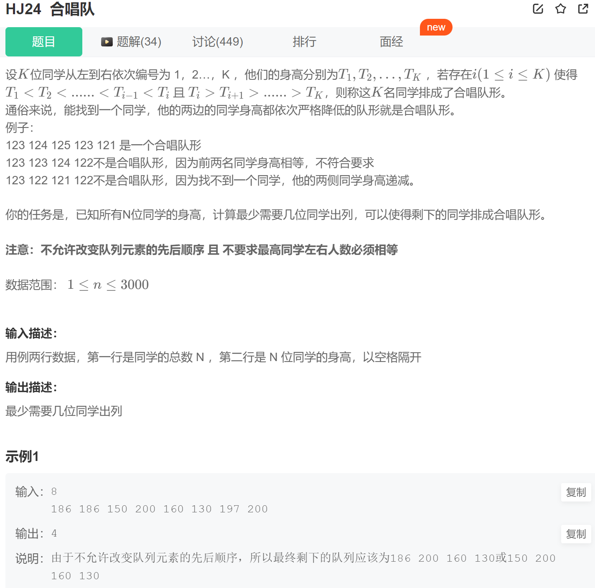

牛客

# 华为机试
## HJ17 坐标移动 middle
```
开发一个坐标计算工具， A表示向左移动，D表示向右移动，W表示向上移动，S表示向下移动。从（0,0）点开始移动，从输入字符串里面读取一些坐标，并将最终输入结果输出到输出文件里面。

输入：

合法坐标为A(或者D或者W或者S) + 数字（两位以内）

坐标之间以;分隔。

非法坐标点需要进行丢弃。如AA10;  A1A;  $%$;  YAD; 等。
```
思路：用正则判断是否合法坐标，然后split("[ASWD]")获得一个数组，首元素是空串，然后遍历某坐标，判断动作若是ASWD合法范围内则迭代索引获取对应数组的动作数进行操作
```java
import java.util.Scanner;
import java.util.regex.Pattern;

public class Main {
    public static void main(String[] args) {
        Scanner in = new Scanner(System.in);
        String[] arr = in.nextLine().split(";");
        int x = 0, y = 0;
        Pattern pattern = Pattern.compile("([AWSD][0-9]{1,2})+");
        for (String str: arr) {
            int index = 0;
            if (pattern.matcher(str).matches()) {
                String[] nums = str.split("[ASWD]");
                for (char c: str.toCharArray()) {
                    if (c == 'A' || c == 'S' || c == 'W' || c == 'D') {
                        int move = Integer.valueOf(nums[++index]);
                        if (c == 'A') x -= move;
                        if (c == 'S') y -= move;
                        if (c == 'W') y += move;
                        if (c == 'D') x += move;
                    }
                }
            }
        }
        System.out.println(x + "," + y);
    }
}
```
## HJ20 密码验证合格程序 middle
```
密码要求:
1.长度超过8位
2.包括大小写字母.数字.其它符号,以上四种至少三种
3.不能有长度大于2的包含公共元素的子串重复 （注：其他符号不含空格或换行）

输入描述：
一组字符串。

输出描述：
如果符合要求输出：OK，否则输出NG
```
思路：用正则判断1、2规则，用哈希表或递归判断3规则
```java
import java.util.*;
import java.util.regex.*;
public class Main {
    public static void main(String[] arg) {
        Scanner sc = new Scanner(System.in);
        while (sc.hasNext()) {
            String str = sc.next();
            if (str.length() <= 8) {
                System.out.println("NG");
                continue;
            }
            if (getMatch(str)) {
                System.out.println("NG");
                continue;
            }
            if (getString2(str)) {
                System.out.println("NG");
                continue;
            }
            System.out.println("OK");
        }
    }
    // 校验是否有重复子串
    //第一种：递归
    private static boolean getString(String str, int l, int r) {
        if (r >= str.length()) {
            return false;
        }
        if (str.substring(r).contains(str.substring(l, r))) {
            return true;
        }
        return getString(str, l + 1, r + 1);
    }
    //第二种：哈希表
    private static boolean getString2(String str) {
        Set<String> set = new HashSet<>();
        for (int i = 0; i <= str.length() - 3; i++) {
            boolean flag = set.add(str.substring(i, i + 3));
            if (!flag) return true;
        }
        return false;
    }
    // 检查是否满足正则
    private static boolean getMatch(String str) {
        int count = 0;
        Pattern p1 = Pattern.compile("[A-Z]");
        if (p1.matcher(str).find()) {
            count++;
        }
        Pattern p2 = Pattern.compile("[a-z]");
        if (p2.matcher(str).find()) {
            count++;
        }
        Pattern p3 = Pattern.compile("[0-9]");
        if (p3.matcher(str).find()) {
            count++;
        }
        Pattern p4 = Pattern.compile("[^a-zA-Z0-9 \n]");
        if (p4.matcher(str).find()) {
            count++;
        }
        if (count >= 3) {
            return false;
        } else {
            return true;
        }
    }
}
```
## HJ24 合唱队 middle

思路：
- 二分查找：由于直接使用动态规划，需要两次遍历数组，借助之前求解最长递增子序列的优化思想，借助二分查找来求解。用一个num数组记录以i为终点的从左向右和从右向走的子序列元素个数。
- 动态规划：分析题目可得，其实就是求最长递增子序列的变种题目，只不过加了一个约束条件，需要左边递增右边递减的情况。 
  - 先找到每一个位置i左侧的最长上升子序列长度left[i]
  - 再找到每一个位置i右侧的最长下降子序列长度right[i]
  - 然后求出所有位置的最长序列长度=左侧最长子序列长度+右侧最长子序列长度-1（因为该位置被算了两次，所以减1）
  - 然后用数目减去最长序列长度就是答案，需要出队的人数
```java
//二分查找
import java.util.Scanner;
public class Main {
    public static void main(String[] args) {
        Scanner sc = new Scanner(System.in);
        while (sc.hasNext()) {
            int n = sc.nextInt();
            int[] arr = new int[n];
            for (int i = 0; i < n; i++) {
                arr[i] = sc.nextInt();
            }

            int[] left = new int[n]; //存储每个数左边小于其的数的个数
            int[] right = new int[n];//存储每个数右边小于其的数的个数
            left[0] = arr[0];
            right[n - 1] = arr[n-1];
            int num[] =new  int [n];//记录以i为终点的从左向右和从右向走的子序列元素个数
            int index = 1;//记录当前子序列的长度
            for(int i=1;i<n;i++){
                if(arr[i]>left[index-1]){
                    //直接放在尾部
                    num[i] = index;//i左侧元素个数
                    left[index++] = arr[i];//更新递增序列
                }else {
                    //找到当前元素应该放在的位置
                    int low = 0,high = index-1;
                    while(low < high){
                        int mid = (low+high)/2;
                        if(left[mid] <arr[i])
                            low = mid + 1;
                        else
                            high = mid;
                    }
                    //将所属位置替换为当前元素
                    left[low] = arr[i];
                    num[i] = low;//当前位置i的左侧元素个数
                }
            }
            index = 1;
            for(int i=n-2;i>=0;i--){
                if(arr[i]>right[index-1]){
                    num[i] += index;
                    right[index++] = arr[i];
                }else {
                    int low = 0,high = index-1;
                    while(low < high){
                        int mid = (high+low)/2;
                        if(right[mid]<arr[i])
                            low = mid+1;
                        else
                            high = mid;
                    }
                    right[low] = arr[i];
                    num[i]+=low;
                }
            }
            int max = 1;
            for (int number: num )
                max = Math.max(max,number);
            // max+1为最大的k
            System.out.println(n - max);
        }
    }
}
//动态规划
public class Main {
    public static void main(String[] args) {
        Scanner sc = new Scanner(System.in);
        while (sc.hasNext()) {
            int n = sc.nextInt();
            int[] arr = new int[n];
            for (int i = 0; i < n; i++) {
                arr[i] = sc.nextInt();
            }

            int[] left = new int[n]; //存储每个数左边小于其的数的个数
            int[] right = new int[n];//存储每个数右边小于其的数的个数
            left[0] = 1;            //最左边的数设为1
            right[n - 1] = 1;        //最右边的数设为1
            //计算每个位置左侧的最长递增
            for (int i = 0; i < n; i++) {
                left[i] = 1;
                for (int j = 0; j < i; j++) {
                    if (arr[i] > arr[j]) {   //动态规划
                        left[i] = Math.max(left[j] + 1, left[i]);
                    }
                }
            }
            //计算每个位置右侧的最长递减
            for (int i = n - 1; i >= 0; i--) {
                right[i] = 1;
                for (int j = n - 1; j > i; j--) {
                    if (arr[i] > arr[j]) {   //动态规划
                        right[i] = Math.max(right[i], right[j] + 1);
                    }
                }
            }
            // 记录每个位置的值
            int[] result = new int[n];
            for (int i = 0; i < n; i++) {
                //位置 i计算了两次 所以需要－1
                result[i] = left[i] + right[i] - 1; //两个都包含本身
            }

            //找到最大的满足要求的值
            int max = 1;
            for (int i = 0; i < n; i++) {
                max = Math.max(result[i],max);
            }
            System.out.println(n - max);
        }

    }
}
```