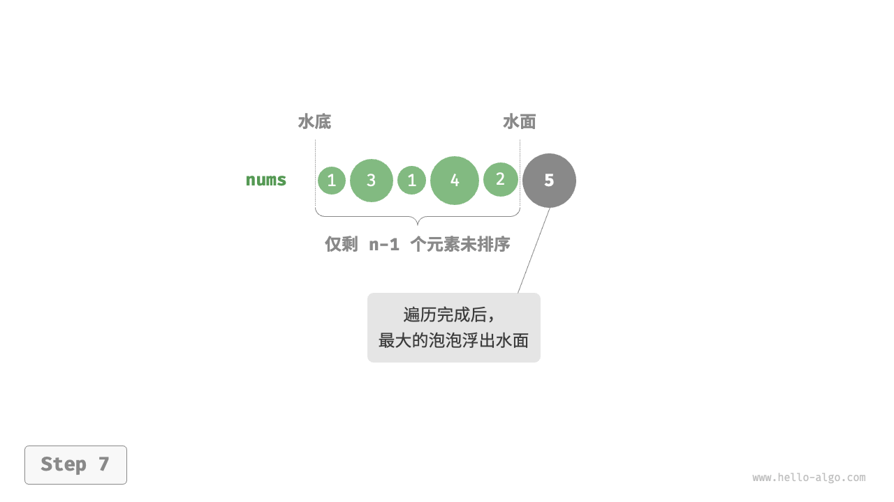
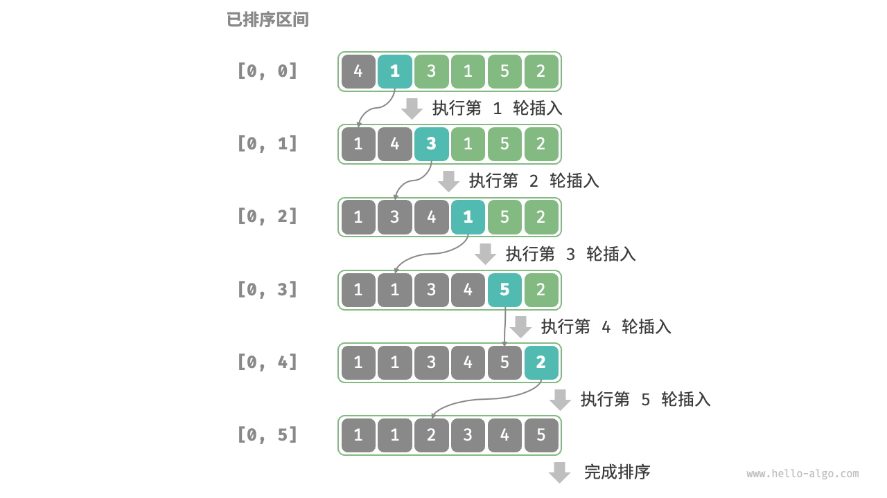

# 排序

## 选择排序
选择排序（selection sort）的工作原理非常简单：开启一个循环，每轮从未排序区间选择最小的元素，将其放到已排序区间的末尾。

### 流程
设数组的长度为n。
1. 初始状态下，所有元素未排序，即未排序（索引）区间为 [0,n-1]。 
2. 选取区间 [0,n-1] 中的最小元素，将其与索引 0 处的元素交换。完成后，数组前 1 个元素已排序。
3. 选取区间 [1,n-1] 中的最小元素，将其与索引 1 处的元素交换。完成后，数组前 2 个元素已排序。 
4. 以此类推。经过 n-1 轮选择与交换后，数组前 n-1 个元素已排序。 
5. 仅剩的一个元素必定是最大元素，无须排序，因此数组排序完成。
```java
/* 选择排序 */
void selectionSort(int[] nums) {
    int n = nums.length;
    // 外循环：未排序区间为 [i, n-1]
    for (int i = 0; i < n - 1; i++) {
        // 内循环：找到未排序区间内的最小元素
        int k = i;
        for (int j = i + 1; j < n; j++) {
            if (nums[j] < nums[k])
                k = j; // 记录最小元素的索引
        }
        // 将该最小元素与未排序区间的首个元素交换
        int temp = nums[i];
        nums[i] = nums[k];
        nums[k] = temp;
    }
}
```

### 特性
* 时间复杂度：O(N^2)
* 空间复杂度：O(1)
* 非稳定排序：如图所示，元素 nums[i] 有可能被交换至与其相等的元素的右边，导致两者的相对顺序发生改变。


## 冒泡排序
通过连续地比较与交换相邻元素实现排序。这个过程就像气泡从底部升到顶部一样，因此得名冒泡排序。从数组最左端开始向右遍历，依次比较相邻元素大小，如果“左元素 > 右元素”就交换二者。遍历完成后，最大的元素会被移动到数组的最右端。


### 流程
设数组的长度为 n
1. 首先，对 n 个元素执行“冒泡”，将数组的最大元素交换至正确位置。
2. 接下来，对剩余 n-1 个元素执行“冒泡”，将第二大元素交换至正确位置。
3. 以此类推，经过 n 轮“冒泡”后，前 大的元素都被交换至正确位置。 
4. 仅剩的一个元素必定是最小元素，无须排序，因此数组排序完成。
优化：如果某轮“冒泡”中没有执行任何交换操作，说明数组已经完成排序，可直接返回结果。因此，可以增加一个标志位 flag 来监测这种情况，一旦出现就立即返回。
```java
/* 冒泡排序 */
void bubbleSort(int[] nums) {
    // 外循环：未排序区间为 [0, i]
    for (int i = nums.length - 1; i > 0; i--) {
        // 内循环：将未排序区间 [0, i] 中的最大元素交换至该区间的最右端
        for (int j = 0; j < i; j++) {
            if (nums[j] > nums[j + 1]) {
                // 交换 nums[j] 与 nums[j + 1]
                int tmp = nums[j];
                nums[j] = nums[j + 1];
                nums[j + 1] = tmp;
            }
        }
    }
}

/* 冒泡排序（标志优化） */
void bubbleSortWithFlag(int[] nums) {
    // 外循环：未排序区间为 [0, i]
    for (int i = nums.length - 1; i > 0; i--) {
        boolean flag = false; // 初始化标志位
        // 内循环：将未排序区间 [0, i] 中的最大元素交换至该区间的最右端
        for (int j = 0; j < i; j++) {
            if (nums[j] > nums[j + 1]) {
                // 交换 nums[j] 与 nums[j + 1]
                int tmp = nums[j];
                nums[j] = nums[j + 1];
                nums[j + 1] = tmp;
                flag = true; // 记录交换元素
            }
        }
        if (!flag)
            break; // 此轮“冒泡”未交换任何元素，直接跳出
    }
}
```

### 特性
* 时间复杂度：O(N^2)，引入flag优化后最佳可达到O(N)
* 空间复杂度：O(1)
* 稳定排序：冒泡过程中相等元素不会互换

## 插入排序
一种简单的排序算法，它的工作原理与手动整理一副牌的过程非常相似。具体来说，我们在未排序区间选择一个基准元素，将该元素与其左侧已排序区间的元素逐一比较大小，并将该元素插入到正确的位置。


### 流程
1. 初始状态下，数组的第 1 个元素已完成排序。
2. 选取数组的第 2 个元素作为 base ，将其插入到正确位置后，数组的前 2 个元素已排序。
3. 选取第 3 个元素作为 base ，将其插入到正确位置后，数组的前 3 个元素已排序。
4. 以此类推，在最后一轮中，选取最后一个元素作为 base ，将其插入到正确位置后，所有元素均已排序。
```java
/* 插入排序 */
void insertionSort(int[] nums) {
    // 外循环：已排序区间为 [0, i-1]
    for (int i = 1; i < nums.length; i++) {
        int base = nums[i], j = i - 1;
        // 内循环：将 base 插入到已排序区间 [0, i-1] 中的正确位置
        while (j >= 0 && nums[j] > base) {
            nums[j + 1] = nums[j]; // 将 nums[j] 向右移动一位
            j--;
        }
        nums[j + 1] = base;        // 将 base 赋值到正确位置
    }
}
```

### 特性
* 时间复杂度：O(N^2)，在遇到有序数据时，插入操作会提前终止。当输入数组完全有序时，插入排序达到最佳时间复杂度O(N)
* 空间复杂度：O(1)
* 稳定排序：在插入操作过程中，我们会将元素插入到相等元素的右侧，不会改变它们的顺序

### 优势
插入排序的时间复杂度为O(N^2)，而快速排序的时间复杂度为O(N*LogN)。尽管插入排序的时间复杂度更高，但在数据量较小的情况下，插入排序通常更快。

这个结论与线性查找和二分查找的适用情况的结论类似。快速排序这类 O(N*LogN) 的算法属于基于分治策略的排序算法，往往包含更多单元计算操作。而在数据量较小时， O(N^2)和 O(N*LogN) 的数值比较接近，复杂度不占主导地位，每轮中的单元操作数量起到决定性作用。

实际上，许多编程语言（例如 Java）的内置排序函数采用了插入排序，大致思路为：对于长数组，采用基于分治策略的排序算法，例如快速排序；对于短数组，直接使用插入排序。

虽然冒泡排序、选择排序和插入排序的时间复杂度都为O(N^2)，但在实际情况中，插入排序的使用频率显著高于冒泡排序和选择排序，主要有以下原因。
* 冒泡排序基于元素交换实现，需要借助一个临时变量，共涉及 3 个单元操作；插入排序基于元素赋值实现，仅需 1 个单元操作。因此，冒泡排序的计算开销通常比插入排序更高。 
* 选择排序在任何情况下的时间复杂度都为 O(N^2)。如果给定一组部分有序的数据，插入排序通常比选择排序效率更高。 
* 选择排序不稳定，无法应用于多级排序。

## 快速排序
一种基于分治策略的排序算法，运行高效，应用广泛。核心操作是“哨兵划分”，其目标是：选择数组中的某个元素作为“基准数”，将所有小于基准数的元素移到其左侧，而大于基准数的元素移到其右侧。

### 流程
1. 选取数组最左端元素作为基准数，初始化两个指针 i 和 j 分别指向数组的两端。
2. 设置一个循环，在每轮中使用 i（j）分别寻找第一个比基准数大（小）的元素，然后交换这两个元素。
3. 循环执行步骤 2. ，直到 i 和 j 相遇时停止，最后将基准数交换至两个子数组的分界线i。
```java
/* 快速排序 */
void quickSort(int[] nums, int left, int right) {
    // 子数组长度为 1 时终止递归
    if (left >= right)
        return;
    // 哨兵划分
    int pivot = partition(nums, left, right);
    // 递归左子数组、右子数组
    quickSort(nums, left, pivot - 1);
    quickSort(nums, pivot + 1, right);
}
/* 哨兵划分 */
int partition(int[] nums, int left, int right) {
    // 以 nums[left] 为基准数
    int i = left, j = right;
    while (i < j) {
        while (i < j && nums[j] >= nums[left])
            j--;          // 从右向左找首个小于基准数的元素
        while (i < j && nums[i] <= nums[left])
            i++;          // 从左向右找首个大于基准数的元素
        swap(nums, i, j); // 交换这两个元素
    }
    swap(nums, i, left);  // 将基准数交换至两子数组的分界线
    return i;             // 返回基准数的索引
}
/* 元素交换 */
void swap(int[] nums, int i, int j) {
    int tmp = nums[i];
    nums[i] = nums[j];
    nums[j] = tmp;
}
```

### 特性
* 时间复杂度：O(N*LogN)，平均情况下哨兵划分的递归层数是LogN，每层中的总循环数为N。最差情况下每轮哨兵划分操作都将长度为n的数组划分为0、n-1子数组，此时递归层数达到n，总体用时O(N^2)
* 空间复杂度：O(N)：虽然是原地移动，但用到了递归栈，输入数组完全倒序的情况下，达到最差递归深度n，O(N)栈帧空间
* 非稳定排序：在哨兵划分的最后一步，基准数可能会被交换至相等元素的右侧。

### 基准数优化
若选择第一个元素作为基准数，在输入数组完全倒序的情况下，在哨兵划分完成后，基准数被交换至数组最右端，导致左子数组长度为 n-1、右子数组长度为 0。如此递归下去，每轮哨兵划分后都有一个子数组的长度为 0，分治策略失效，快速排序退化为“冒泡排序”的近似形式。

可以使用随机数选取基准元素，但编程语言通常生成的是“伪随机数”，如果我们针对伪随机数序列构建一个特定的测试样例，那么快速排序的效率仍然可能劣化。 为了进一步改进，我们可以在数组中选取三个候选元素（通常为数组的首、尾、中点元素），并将这三个候选元素的中位数作为基准数。这样一来，基准数“既不太小也不太大”的概率将大幅提升。当然，我们还可以选取更多候选元素，以进一步提高算法的稳健性。采用这种方法后，时间复杂度劣化至 O(N^2) 的概率大大降低。
```java
class Solution {
    public int[] sortArray(int[] nums) {
        randomizedQuicksort(nums, 0, nums.length - 1);
        return nums;
    }

    public void randomizedQuicksort(int[] nums, int l, int r) {
        if (l < r) {
            int pos = randomizedPartition(nums, l, r);
            randomizedQuicksort(nums, l, pos - 1);
            randomizedQuicksort(nums, pos + 1, r);
        }
    }

    public int randomizedPartition(int[] nums, int l, int r) {
        int i = new Random().nextInt(r - l + 1) + l; // 随机选一个作为我们的主元
        swap(nums, r, i);
        return partition(nums, l, r);
    }

    public int partition(int[] nums, int l, int r) {
        int pivot = nums[r];
        int i = l - 1;
        for (int j = l; j <= r - 1; ++j) {
            if (nums[j] <= pivot) {
                i = i + 1;
                swap(nums, i, j);
            }
        }
        swap(nums, i + 1, r);
        return i + 1;
    }

    private void swap(int[] nums, int i, int j) {
        int temp = nums[i];
        nums[i] = nums[j];
        nums[j] = temp;
    }
}
```

### 尾递归优化
完全倒序情况下达到最差空间复杂度O(N)。为了防止栈帧空间的累积，我们可以在每轮哨兵排序完成后，比较两个子数组的长度，仅对较短的子数组进行递归。由于较短子数组的长度不会超过N/2，因此这种方法能确保递归深度不超过LogN，从而将最差空间复杂度优化至O(LogN)
```java
/* 快速排序（尾递归优化） */
void quickSort(int[] nums, int left, int right) {
    // 子数组长度为 1 时终止
    while (left < right) {
        // 哨兵划分操作
        int pivot = partition(nums, left, right);
        // 对两个子数组中较短的那个执行快速排序
        if (pivot - left < right - pivot) {
            quickSort(nums, left, pivot - 1); // 递归排序左子数组
            left = pivot + 1; // 剩余未排序区间为 [pivot + 1, right]
        } else {
            quickSort(nums, pivot + 1, right); // 递归排序右子数组
            right = pivot - 1; // 剩余未排序区间为 [left, pivot - 1]
        }
    }
}
```

## 归并排序
merge sort排序，基于分治策略的排序算法
* 划分阶段：通过递归不断地将数组从中点处分开，将长数组的排序问题转换为短数组的排序问题。
* 合并阶段：当子数组长度为 1 时终止划分，开始合并，持续地将左右两个较短的有序数组合并为一个较长的有序数组，直至结束。


### 流程
“递归划分阶段”从顶至底递归地将数组从中点切分为两个子数组。
1. 计算数组中点 mid ，递归划分左子数组（区间 [left, mid] ）和右子数组（区间 [mid + 1, right] ）。
2. 递归执行步骤 1，直至子数组区间长度为 1 时终止。
“回溯合并阶段”从底至顶地将左子数组和右子数组合并为一个有序数组。需要注意的是，从长度为 1 的子数组开始合并，合并阶段中的每个子数组都是有序的。类似于二叉树的后序遍历
```java
/* 归并排序 */
void mergeSort(int[] nums, int left, int right) {
    if (left >= right)
        return; // 当子数组长度为 1 时终止递归
    // 划分阶段
    int mid = left + (right - left) / 2; // 计算中点
    mergeSort(nums, left, mid); // 递归左子数组
    mergeSort(nums, mid + 1, right); // 递归右子数组
    // 合并阶段
    merge(nums, left, mid, right);
}
/* 合并左子数组和右子数组 */
void merge(int[] nums, int left, int mid, int right) {
    int[] tmp = new int[right - left + 1];
    int i = left, j = mid + 1, k = 0;
    while (i <= mid && j <= right) {
        if (nums[i] <= nums[j]) tmp[k++] = nums[i++];
        else tmp[k++] = nums[j++];
    }
    // 将左子数组和右子数组的剩余元素复制到临时数组中
    while (i <= mid) {
        tmp[k++] = nums[i++];
    }
    while (j <= right) {
        tmp[k++] = nums[j++];
    }
    // 将临时数组 tmp 中的元素复制回原数组 nums 的对应区间
    for (k = 0; k < tmp.length; k++) {
        nums[left + k] = tmp[k];
    }
}
```

### 特性
* 时间复杂度：O(N*LogN)。划分产生高度为 LogN 的递归树，每层合并的总操作数量为 N
* 空间复杂度：O(N)
* 稳定排序：在合并过程中，相等元素的次序保持不变。
 