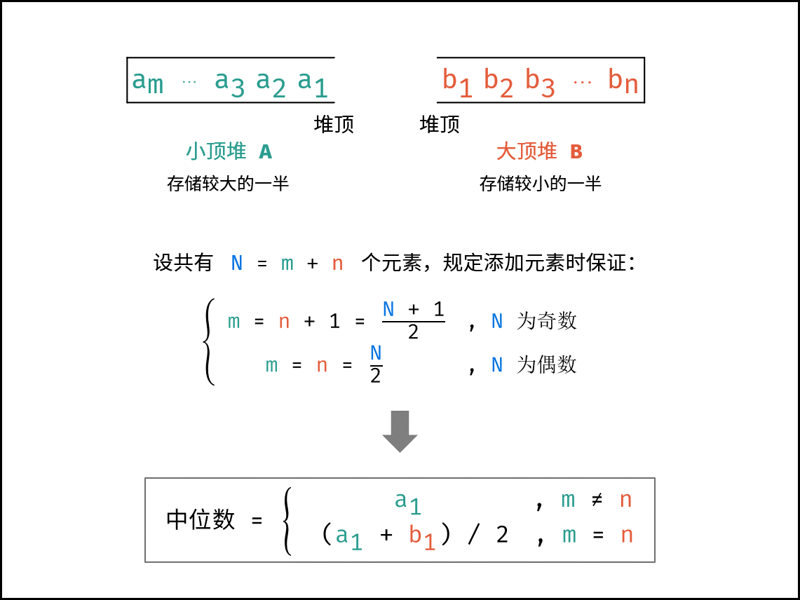

# 栈和队列
先进后出，擅长相邻元素的消除
## 232 用两个栈实现队列 easy
```
请你仅使用两个栈实现先入先出队列。队列应当支持一般队列支持的所有操作（push、pop、peek、empty）：

实现 MyQueue 类：

void push(int x) 将元素 x 推到队列的末尾
int pop() 从队列的开头移除并返回元素
int peek() 返回队列开头的元素
boolean empty() 如果队列为空，返回 true ；否则，返回 false
```
思路：使用Stack作为栈的结构，用两个栈，入栈和出栈，写时直接放到入栈，读时则只从出栈读，若出栈无数据则先把入栈所有数据放到出栈后再操作
```java
import java.util.Stack;

class MyQueue {
    Stack<Integer> inStack;
    Stack<Integer> outStack;

    public MyQueue() {
        inStack = new Stack<>();
        outStack = new Stack<>();
    }
    
    public void push(int x) {
        inStack.push(x);
    }
    
    public int pop() {
        if (outStack.isEmpty()) {
            in2Out();
        }
        return outStack.pop();
    }
    
    public int peek() {
        if (outStack.isEmpty()) {
            in2Out();
        }
        return outStack.peek();
    }
    
    public boolean empty() {
        return inStack.isEmpty() && outStack.isEmpty();
    }

    private void in2Out() {
        while (!inStack.isEmpty()) {
            outStack.push(inStack.pop());
        }
    }
}
```
## 225 用一个队列模拟栈 easy
```
请你仅使用两个队列实现一个后入先出（LIFO）的栈，并支持普通栈的全部四种操作（push、top、pop 和 empty）。

实现 MyStack 类：

void push(int x) 将元素 x 压入栈顶。
int pop() 移除并返回栈顶元素。
int top() 返回栈顶元素。
boolean empty() 如果栈是空的，返回 true ；否则，返回 false 。
```
思路：使用LinkedList作为队列，每次写后都把刚加入元素之前的其他元素重新出队再入队，其他操作直接调用队列的方法就行
```java
class MyStack {
    Queue<Integer> queue;

    public MyStack() {
        queue = new LinkedList<>();
    }
    
    public void push(int x) {
        queue.offer(x);
        int size = queue.size();
        while (--size > 0) {
            queue.offer(queue.poll());
        }
    }
    
    public int pop() {
        return queue.poll();
    }
    
    public int top() {
        return queue.peek();
    }
    
    public boolean empty() {
        return queue.isEmpty();
    }
}
```
## 155 最小栈 middle
```
设计一个支持 push ，pop ，top 操作，并能在常数时间内检索到最小元素的栈。

实现 MinStack 类:

MinStack() 初始化堆栈对象。
void push(int val) 将元素val推入堆栈。
void pop() 删除堆栈顶部的元素。
int top() 获取堆栈顶部的元素。
int getMin() 获取堆栈中的最小元素。
```
思路：只需要设计一个数据结构，使得每个元素 a 与其相应的最小值 m 时刻保持一一对应。因此我们可以使用一个辅助栈，与元素栈同步插入与删除，用于存储与每个元素对应的最小值。
- 当一个元素要入栈时，我们取当前辅助栈的栈顶存储的最小值，与当前元素比较得出最小值，将这个最小值插入辅助栈中；
- 当一个元素要出栈时，我们把辅助栈的栈顶元素也一并弹出；
- 在任意一个时刻，栈内元素的最小值就存储在辅助栈的栈顶元素中。
```java
class MinStack {
    Deque<Integer> xStack; //元素栈
    Deque<Integer> minStack; //对应元素的最小栈，与元素栈中的每个元素一一对应

    public MinStack() {
        xStack = new LinkedList<Integer>();
        minStack = new LinkedList<Integer>();
        minStack.push(Integer.MAX_VALUE);
    }
    
    public void push(int x) {
        xStack.push(x);
        minStack.push(Math.min(minStack.peek(), x));
    }
    
    public void pop() {
        xStack.pop();
        minStack.pop();
    }
    
    public int top() {
        return xStack.peek();
    }
    
    public int getMin() {
        return minStack.peek();
    }
}
```
## 20 有效的括号 easy
```java
class Solution {
    public boolean isValid(String s) {
        Stack<Character> stack = new Stack<>();
        for (Character c: s.toCharArray()) {
            if (c == '(' || c == '[' || c == '{') stack.push(c);
            else if (c == ')' || c == ']' || c == '}') {
                if (stack.isEmpty()) return false;
                if (c == ')' && stack.pop() != '(') return false;
                if (c == ']' && stack.pop() != '[') return false;
                if (c == '}' && stack.pop() != '{') return false;
            }
        }
        return stack.isEmpty();
    }
}
```
## 32 最长有效括号 hard 阿里一面
```
给你一个只包含 '(' 和 ')' 的字符串，找出最长有效（格式正确且连续）括号子串的长度。

输入：s = ")()())"
输出：4
解释：最长有效括号子串是 "()()"
```
思路：
始终保持栈底元素为当前已经遍历过的元素中「最后一个没有被匹配的右括号的下标」，这样是为了用于判断边界条件，栈里的其他元素维护左括号的下标
- 遍历到每个 '('，将下标入栈
- 遍历到每个 ')'，先弹出栈顶元素表示匹配了当前右括号
  - 若栈为空，说明当前右括号没有被匹配，将其下标放入栈中来更新我们之前提到的「最后一个没有被匹配的右括号的下标」
  - 若栈非空，当前右括号的下标减去栈顶元素即为「以该右括号为结尾的最长有效括号的长度」

而且需要注意，如果一开始栈为空，第一个字符为左括号的时候我们会将其放入栈中，这样就不满足提及的「最后一个没有被匹配的右括号的下标」，为了保持统一，我们在一开始的时候往栈中放入一个值为 -1 的元素。
```java
class Solution {
    public int longestValidParentheses(String s) {
        int maxans = 0;
        Stack<Integer> stack = new Stack<>();
        stack.push(-1);
        for (int i = 0; i < s.length(); i++) {
            if (s.charAt(i) == '(') {
                stack.push(i);
            } else {
                stack.pop();
                if (stack.empty()) {
                    stack.push(i);
                } else {
                    maxans = Math.max(maxans, i - stack.peek());
                }
            }
        }
        return maxans;
    }
}
```
## 1047 删除字符串中的所有相邻重复项 easy
```java
class Solution {
    public String removeDuplicates(String s) {
        Deque<Character> stack = new ArrayDeque<>();
        String result = "";
        for (Character c : s.toCharArray()) {
            if (!stack.isEmpty() && stack.peek().equals(c)) stack.pop();
            else stack.push(c);
        }
        while (!stack.isEmpty()) {
            result += stack.removeLast();
        }
        return result;
    }
}
```
## 150 逆波兰表达式 middle
即后缀表达式，二叉树的后序遍历
```java
class Solution {
    public int evalRPN(String[] tokens) {
        Stack<Integer> stack = new Stack<>();
        Map<String, BiFunction<Integer, Integer, Integer>> map = new HashMap<>();
        map.put("+", (x, y) -> x + y);
        map.put("-", (x, y) -> x - y);
        map.put("*", (x, y) -> x * y);
        map.put("/", (x, y) -> x / y);
        for (String token: tokens) {
            if (!map.containsKey(token)) stack.push(Integer.valueOf(token));
            else {
                Integer y = stack.pop();
                Integer x = stack.pop();
                stack.push(map.get(token).apply(x, y));
            }
        }
        return stack.pop();
    }
}
```
## 239 滑动窗口最大值 hard
```
给你一个整数数组 nums，有一个大小为 k 的滑动窗口从数组的最左侧移动到数组的最右侧。你只可以看到在滑动窗口内的 k 个数字。滑动窗口每次只向右移动一位。
返回 滑动窗口中的最大值 。
```
思路：使用优先级队列最大堆可以解决，元素是数组值、下标结构，堆顶元素即为当前堆的最大值，先初始化第一个窗口的值，再加入新的值到队列，循环判断当前堆顶元素这是否在窗口中，不在则删除堆顶元素，然后此时的栈顶元素即当前窗口的最大值
```java
class Solution {
    public int[] maxSlidingWindow(int[] nums, int k) {
        Queue<int[]> queue = new PriorityQueue<>((p1, p2) -> p1[0] == p2[0] ? p2[1] - p1[1] : p2[0] - p1[0]);
        for (int i = 0; i < k; i++) {
            queue.offer(new int[]{nums[i], i});
        }
        int[] result = new int[nums.length - k + 1];
        int index = 0;
        result[0] = queue.peek()[0];
        for (int i = k; i < nums.length; i++) {
            queue.offer(new int[]{nums[i], i});
            while (queue.peek()[1] < i - k + 1) queue.poll();
            result[++index] = queue.peek()[0];
        }
        return result;
    }
}
```
## 347 前k个高频元素 middle
```
给你一个整数数组 nums 和一个整数 k ，请你返回其中出现频率前 k 高的元素。你可以按 任意顺序 返回答案。
```
思路：最小堆PriorityQueue，先使用HashMap统计出所有元素的次数，然后依次加到堆里，入堆前先判断堆的元素个数是否小于k，若小于则直接入堆，不小于则判断若堆顶元素的频率小于要加的元素就先抛出堆顶元素再入堆
```java
class Solution {
    public int[] topKFrequent(int[] nums, int k) {
        Queue<Map.Entry<Integer, Integer>> queue = new PriorityQueue<>((p1, p2) -> p1.getValue() - p2.getValue());
        Map<Integer, Integer> map = new HashMap<>();
        int[] result = new int[k];

        for (int i: nums) {
            map.compute(i, (key, value) -> value == null ? 1 : value + 1);
        }
        for (Map.Entry<Integer, Integer> entry: map.entrySet()) {
            if (queue.size() < k) queue.offer(entry);
            else if (queue.peek().getValue() < entry.getValue()) {
                queue.poll();
                queue.offer(entry);
            }
        }
        for (int i = 0; i < k; i++) {
            result[i] = queue.poll().getKey();
        }
        return result;
    }
}
```
## 394 字符串解码 middle
```
给定一个经过编码的字符串，返回它解码后的字符串。
编码规则为: k[encoded_string]，表示其中方括号内部的 encoded_string 正好重复 k 次。注意 k 保证为正整数。
你可以认为输入字符串总是有效的；输入字符串中没有额外的空格，且输入的方括号总是符合格式要求的。
此外，你可以认为原始数据不包含数字，所有的数字只表示重复的次数 k ，例如不会出现像 3a 或 2[4] 的输入。

输入：s = "3[a]2[bc]"
输出："aaabcbc"
```
思路：用num存当前的重复次数，nums存每个[]前的重复次数，sb存收集的结果，strs存每个[]前已收集的字符串，。遍历输入字符串，若是数字则更新num，若是字符则收集到sb，若是`[`则把sb压入strs栈且重置sb，把num压入nums并重置num，若是`]`则根据nums栈顶元素重复把sb append到strs栈顶元素，然后弹出strs栈顶元素并赋值sb
```java
class Solution {
  public String decodeString(String s) {
    int num = 0; // 记录重复次数，次数可能>10
    Stack<Integer> nums = new Stack<>(); //存储每个[]前的重复次数
    StringBuilder sb = new StringBuilder(); // 收集结果
    Stack<StringBuilder> strs = new Stack<>(); //进入[]前存储已收集的串
    
    for(char c : s.toCharArray()){
      if (c >= '0' && c <= '9') num = num * 10 + c - '0';
      else if (Character.toLowerCase(c) >= 'a' && Character.toLowerCase(c) <= 'z') sb.append(c);
      else if (c == '[') {
        strs.push(sb); //把之前收集的字符串存入栈
        sb = new StringBuilder();
        nums.push(num); //接下来的重复次数存入栈
        num = 0;
      } else if (c == ']') {
        int times = nums.pop();
        while (times-- > 0) {
          strs.peek().append(sb);
        }
        sb = strs.pop();
      }
    }
    return sb.toString();
  }
}
```
## 215 数组中的第K个最大元素 middle
```
给定整数数组 nums 和整数 k，请返回数组中第 k 个最大的元素。

请注意，你需要找的是数组排序后的第 k 个最大的元素，而不是第 k 个不同的元素。

你必须设计并实现时间复杂度为 O(n) 的算法解决此问题。
```
思路：
- 快排算法，O(N)，推荐用。快速排序的核心包括“哨兵划分” 和 “递归” 。
  - 哨兵划分： 以数组某个元素（一般选取首元素）为基准数，将所有小于基准数的元素移动至其左边，大于基准数的元素移动至其右边。
  - 递归： 对 左子数组 和 右子数组 递归执行 哨兵划分，直至子数组长度为 1 时终止递归，即可完成对整个数组的排序。可以把最终的数组看做big+equal+small按顺序组合成的，当k<=big数组长度时，说明在big内，因此要在big内递归，其他同理。

```java
public class Solution {
    public int findKthLargest(int[] nums, int k) {
        List<Integer> numList = new ArrayList<>();
        for (int num : nums) {
            numList.add(num);
        }
        return quickSelect(numList, k);
    }
    private int quickSelect(List<Integer> nums, int k) {
        // 随机选择基准数
        Random rand = new Random();
        int pivot = nums.get(rand.nextInt(nums.size()));
        // 将大于、小于、等于 pivot 的元素划分至 big, small, equal 中
        List<Integer> big = new ArrayList<>();
        List<Integer> equal = new ArrayList<>();
        List<Integer> small = new ArrayList<>();
        for (int num : nums) {
            if (num > pivot)
                big.add(num);
            else if (num < pivot)
                small.add(num);
            else
                equal.add(num);
        }
        // 第 k 大元素在 big 中，递归划分。因为此时较大的组的元素个数不小于k，肯定有第k大元素
          if (k <= big.size())
            return quickSelect(big, k);
        // 第 k 大元素在 small 中，递归划分
        if (k > big.size() + equal.size())
            return quickSelect(small, k - big.size() - equal.size());
        // 第 k 大元素在 equal 中，直接返回 pivot
        return pivot;
    }
}
```
- 小顶堆。可以使用PriorityQueue或者手动实现，但这个严格来说是O(N*logN)
```java
class Solution {
    public int findKthLargest(int[] nums, int k) {
        PriorityQueue<Integer> pq=new PriorityQueue<>(k);
        for (int num : nums) {
            if (pq.size() < k) {
                pq.offer(num);
            } else if (num > pq.peek()) {
                pq.poll();
                pq.offer(num);
            }
        }
        return pq.peek();
    }
}
```
## 295 数据流的中位数 hard
```
中位数是有序整数列表中的中间值。如果列表的大小是偶数，则没有中间值，中位数是两个中间值的平均值。

例如 arr = [2,3,4] 的中位数是 3 。
例如 arr = [2,3] 的中位数是 (2 + 3) / 2 = 2.5 。
实现 MedianFinder 类:

MedianFinder() 初始化 MedianFinder 对象。

void addNum(int num) 将数据流中的整数 num 添加到数据结构中。

double findMedian() 返回到目前为止所有元素的中位数。与实际答案相差 10-5 以内的答案将被接受。
```
思路：给定一长度为 N 的无序数组，其中位数的计算方法：首先对数组执行排序（使用 O(NlogN) 时间），然后返回中间元素即可（使用 O(1) 时间）
- 建立一个 小顶堆 A 和 大顶堆 B ，各保存列表的一半元素，且规定：
  - A保存较大的一半，长度为偶N/2或奇(N+1)/2，数量设为m
  - B保存较小的一半，长度为偶N/2或奇(N-1)/2，数量设为n
- 函数 addNum(num) ：
  - m!=n 此时N是奇数，m=n+1，需向B添加一个元素num，而由于num可能需要A即较大的一半范围内，因此先向A添加，然后把A堆顶元素弹出到B
  - m==n 此时N是偶数，m=n，需向A添加一个元素num
- 函数 findMedian()：
  - m!=n，中位数是A堆顶
  - m==n，中位数是(A堆顶+B堆顶)/2

```java
class MedianFinder {
    Queue<Integer> A, B;
    public MedianFinder() {
        A = new PriorityQueue<>(); // 小顶堆，保存较大的一半
        B = new PriorityQueue<>((x, y) -> (y - x)); // 大顶堆，保存较小的一半
    }
    public void addNum(int num) {
        if (A.size() != B.size()) {
            A.add(num);
            B.add(A.poll());
        } else {
            B.add(num);
            A.add(B.poll());
        }
    }
    public double findMedian() {
        return A.size() != B.size() ? A.peek() : (A.peek() + B.peek()) / 2.0;
    }
}
```